# karl-和平精英详细设置截图

---

> [基础设置](#基础设置)  
> [画面设置](#画面设置)  
> [操作设置](#操作设置)  
> [载具设置](#载具设置)  
> [灵敏度设置](#灵敏度设置)  
> [拾取设置](#拾取设置)  
> [效果设置](#效果设置)  
> [声音设置](#声音设置)

---

## 基础设置
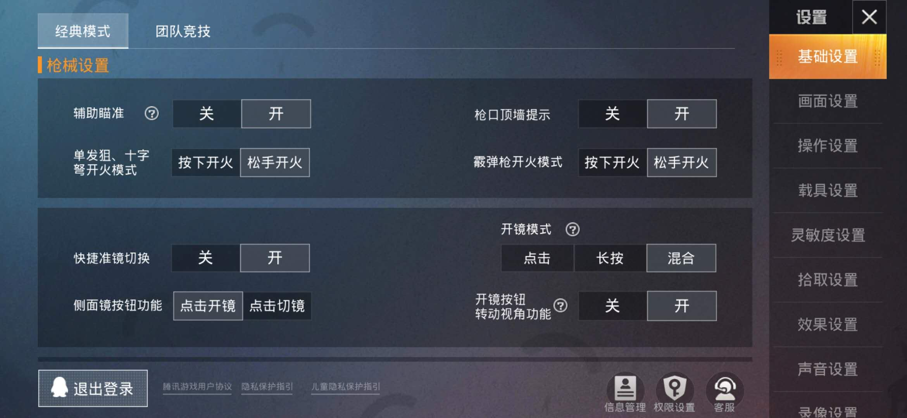
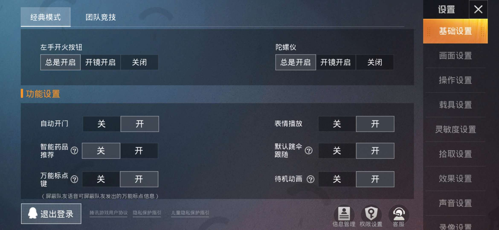

## 画面设置
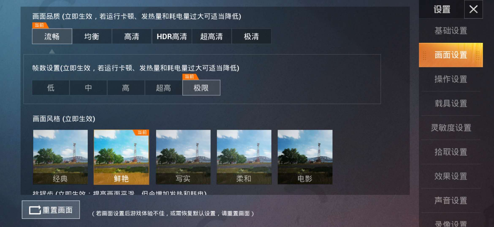
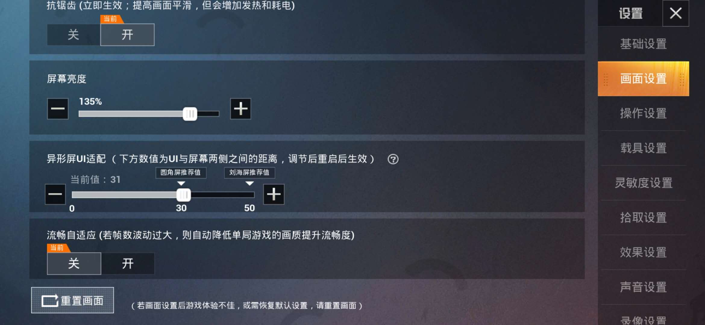
## 操作设置
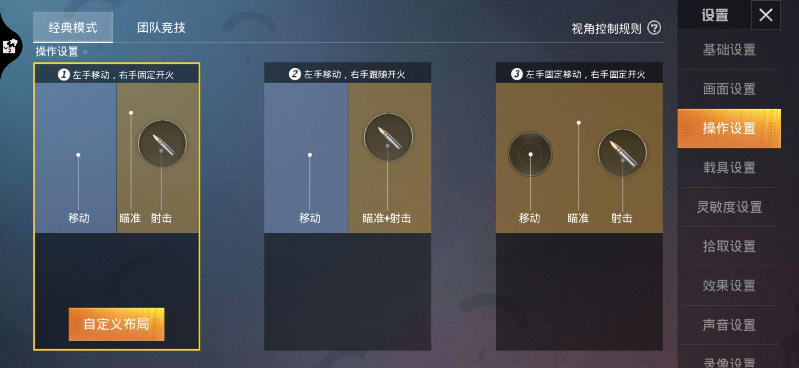

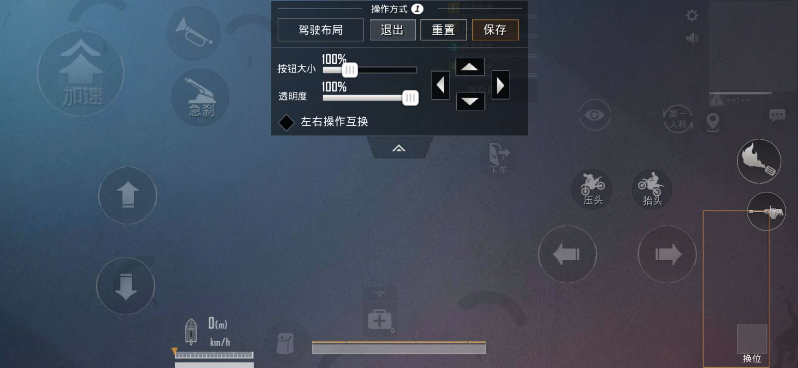
## 载具设置
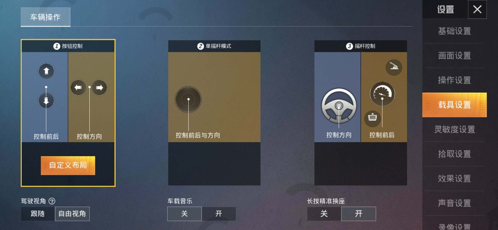
## 灵敏度设置
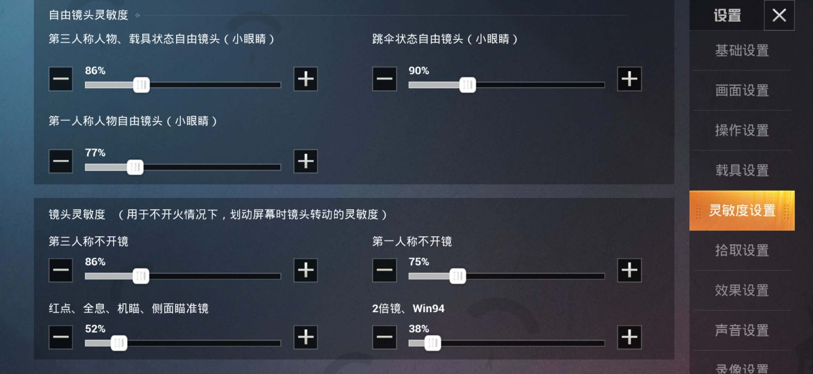
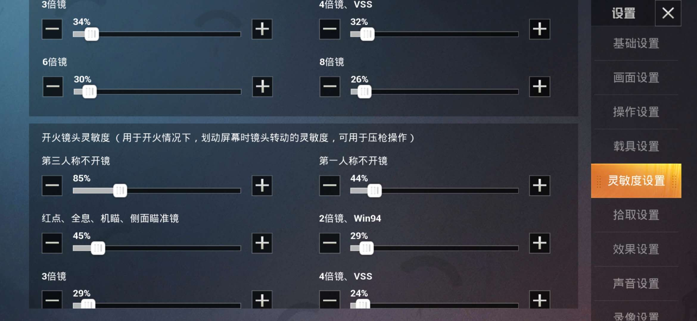
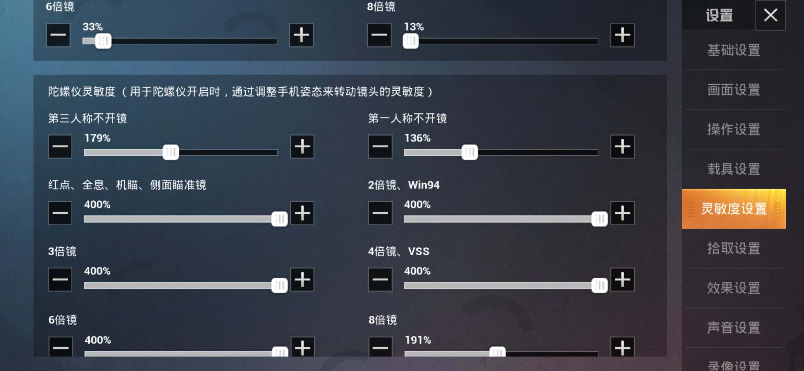
## 拾取设置

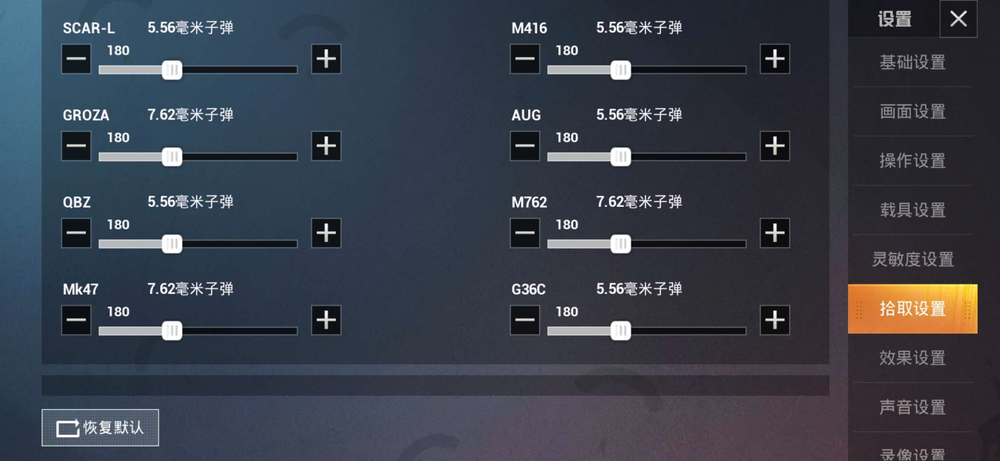
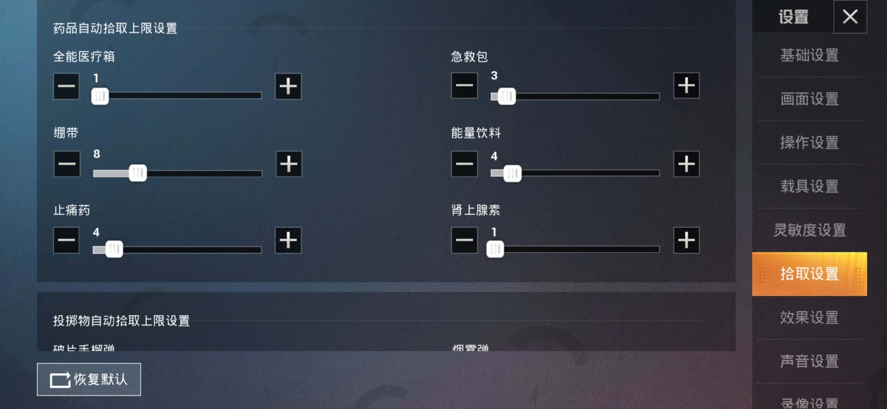

## 效果设置

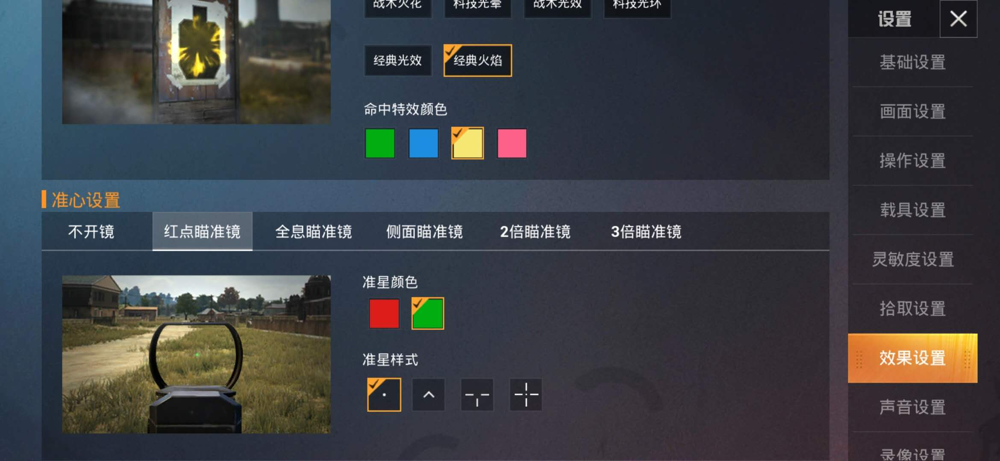
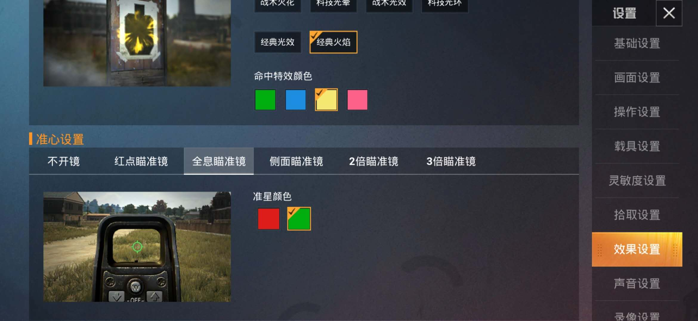

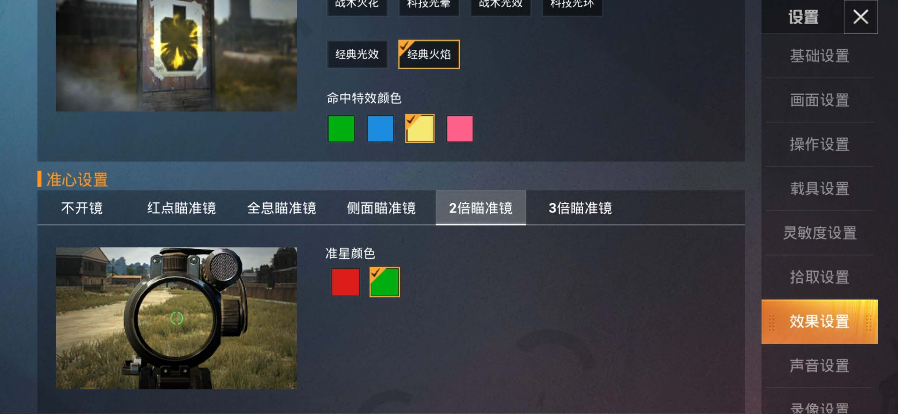
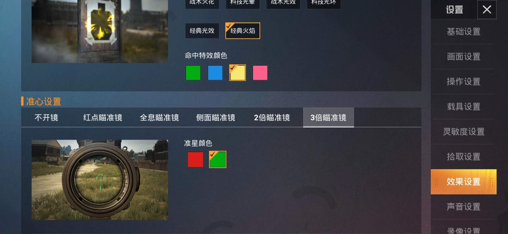
## 声音设置
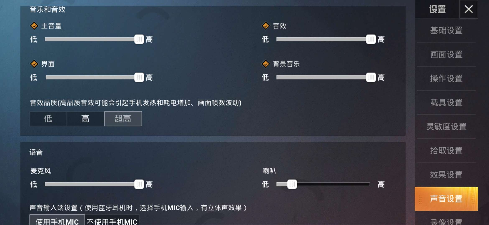

---

- [返回](https://code.aliyun.com/kangxianghui/gamesword/tree/master)